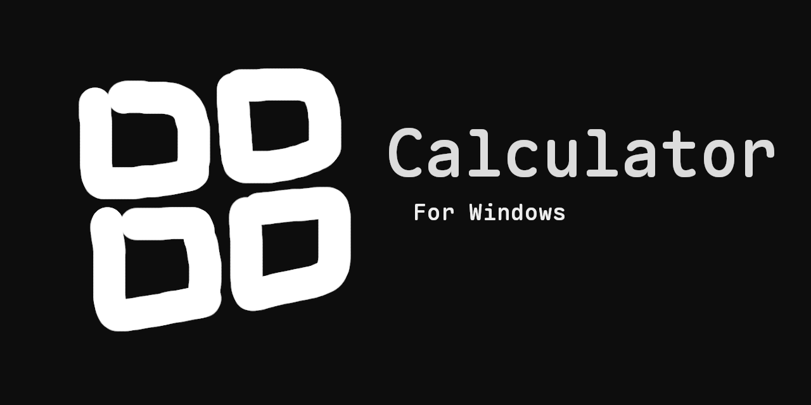
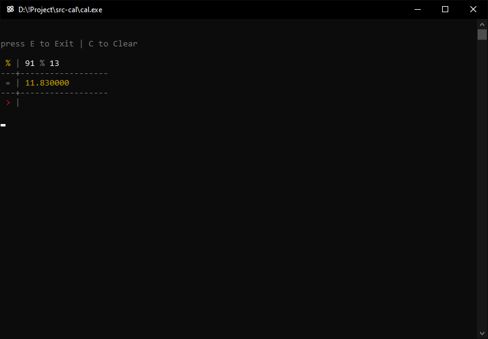

# Cal

➗ Cal is a simple calculator for Windows.


## Features:
- **Decimal** – Supports decimal precision up to 6 places.
- **Functions** - Includes addition, subtraction, multiplication, division, and percentage functions.
- **ANSI** - ANSI color-coded input, history, and output.

## Demo:


## Usage:
- Run:
    ```sh
    > cal.exe
    ```

## Build:
- **Install Dependencies:**
    - Download and install [MSYS2](https://www.msys2.org/).
    - Open the **mingw64.exe** shell (from the MSYS2 Start Menu).
    - Run the following commands:
        ```sh
        $ pacman -Syu        # Update system packages (MSYS2 may restart)
        $ pacman -Syu        # Run again after restart
        $ pacman -S --needed base-devel mingw-w64-x86_64-toolchain
        ```

- **Set Environment Variables:**
    - Open the **Environment Variables**:
        ```sh
        > rundll32.exe sysdm.cpl,EditEnvironmentVariables   # run in Command Prompt
        ```
    - Add the following paths to your **Path** variable:
        ```
        C:\msys64\mingw64\bin\
        C:\msys64\usr\bin\
        ```

- **Verify Installation:**
    - Run these commands to confirm:
        ```
        > gcc --version
        > g++ --version
        ```
    - If you see version output, your installation was successful 👍

- **Build the Project:**
    - Just run `build.bat`
    - The file `cal.exe` will appear inside the Source folder.

## Project Structure:
The project has the following structure:

```
.
│
├── build.bat
├── banner.png
├── cal.c
├── icon.ico
├── icon.rc
├── LICENSE
├── README.md
│
└─── demo
      └─── pic_1.png
```

## Contributing:
Feel free to contribute to this project by submitting pull requests or reporting issues. Your contributions are greatly appreciated!

## License:
This project is licensed under the [MIT License](LICENSE).

😄 Happy coding!
